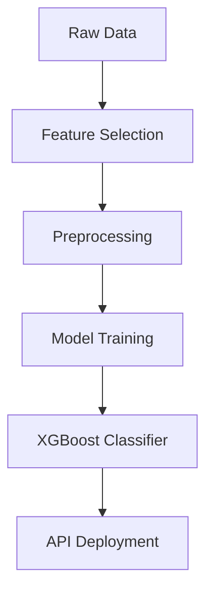

# 🌿 Prakriti Nishchikaran: Machine Learning for Ayurvedic Body Constitution Analysis

## 📖 Table of Contents
- [Introduction](#-introduction)
- [Motivation](#-motivation)
- [Team members](#-team-members)
- [What is Prakriti?](#-what-is-prakriti)
- [Features](#-features)
- [Technical Implementation](#-technical-implementation)
- [API Usage](#-api-usage)
- [Model Evaluation](#-model-evaluation)
- [Web Application](#-web-application)
- [Applications & Future Scope](#-applications--future-scope)
- [Acknowledgements](#-acknowledgements)

---

## 🌟 Introduction

Prakriti Nishchikaran is an innovative machine learning system that analyzes 40+ bio-behavioral traits to determine an individual's Ayurvedic body constitution (Prakriti) with 88.5% accuracy. This project bridges ancient Ayurvedic wisdom with modern technology, providing a standardized, scalable solution for Prakriti analysis.

> 🔮 **Accuracy**: 88.5%  
> 🚀 **Live**: [link](https://prakrutinischikaran.netlify.app/)  

---
##  👨‍🏫 Team Members
| Name                     | Role                           | Username                       |
| ------------------------ | ------------------------------ | ------------------------------ |
| **Dr. Krantee Jamdaade** | Mentor, Dataset Contributor    | Nil                            |
| **Benjamin Sebastian**   | Full Stack Developer, ML Model | @SebastianBenjamin             |
| **Arunima Pandey**       | Research & Frontend Developer  | @Arunima04                     |

---

## 💡 Motivation

The project was inspired by the story of Rajesh, a software engineer who suffered health collapse due to work stress. Traditional Ayurvedic diagnosis faced several challenges:

- **Practitioner-dependent** results with high variability
- **Limited accessibility** requiring in-person consultations
- **Lack of standardization** in assessments
- **Scarcity of experts**

Our solution addresses these by:
- Providing **objective analysis** through machine learning
- Creating a **digital platform** accessible anywhere
- Developing **quantifiable metrics** for human traits
- Delivering **instant results** with high accuracy

---

## 🧘 What is Prakriti?

Prakriti refers to an individual's inherent **mind-body constitution**, determined by the unique combination of three doshas:

- **Vata**: Associated with movement and creativity
- **Pitta**: Governs metabolism and transformation
- **Kapha**: Provides structure and lubrication

Each person has a distinct ratio of these doshas that remains **constant throughout life**, serving as a unique biological blueprint for health and wellness.

---

## ✨ Features

- **Advanced ML Model**: XGBoost classifier trained on 55+ bio-behavioral traits
- **Standardized Framework**: Quantitative analysis of traditionally qualitative parameters
- **Cloud Hosting**: 
  - API hosted on **Render**
  - Frontend interface on **Netlify**
- **Comprehensive Output**:
  - Primary Prakriti prediction
  - Probabilities for all dosha combinations
  - Integration with Google Gemini for detailed interpretations

---

## 💻 Technical Implementation

### 🛠️ Model Development Journey

1. **Data Collection**:
   - Initial dataset with 71 columns from Ayurvedic research
   - Added encoded Prakriti column (1=Pittaj, 2=Vataj, 3=Kaphaj)

2. **Feature Selection**:
   - Started with 5 key features:
     - Usual body temperature
     - Appetite
     - Sleep patterns
     - Emotion
     - Physique
   - Expanded to 55+ features after initial testing

3. **Model Comparison**:
   - Tested multiple algorithms:
     - Random Forest
     - KNN
     - Decision Tree
     - XGBoost
     - Voting Classifier combinations
   - **XGBoost** selected for its sequential learning and feature dependency handling

4. **Preprocessing**:
   - SMOTE for handling class imbalance
   - Label Encoding for target variable
   - Standard Scaling for feature normalization

### 📊 Model Architecture



---

## 📡 API Usage

### 🔗 Endpoints

```bash
GET / (Root URL)
https://prakruthinischikaran-api.onrender.com
```

```bash
POST /predict
https://prakruthinischikaran-api.onrender.com/predict
```

### 📥 Sample Input

```json
{
  "Skin color": 1,
  "Skin texture": 1,
  "Hair quality": 1,
  ... [40+ additional features]
}
```

### 📤 Sample Response

```json
{
  "prediction": "Vataj",
  "probabilities": {
    "Kaphaj": 0.0068,
    "Kaphaj-Pittaj": 0.0069,
    "Pittaj": 0.0458,
    "Pittaj-Kaphaj": 0.0818,
    "Pittaj-Vataj": 0.0072,
    "Vataj": 0.7019,
    "Vataj-Pittaj": 0.1493
  }
}
```

### 🧪 Test Script

```python
import requests

url = "https://prakruthinischikaran-api.onrender.com/predict"
data = {
    "Skin color": 1,
    "Skin texture": 1,
    # ... [complete feature set]
}

response = requests.post(url, json=data)
print("Status Code:", response.status_code)
print("Response:", response.json())
```

---

## 📈 Model Evaluation

### 🧠 Feature Importance


*Top influential features in the XGBoost model*

### 📊 Classification Metrics


*Precision, recall, and f1-scores for each dosha class*

### 🔄 Confusion Matrix


*Model performance across different Prakriti types*

---

## 🌐 Web Application

The system includes a user-friendly web interface with:
- **Interactive form** for trait input
- **Visual results dashboard** showing dosha distribution
- **Gemini AI integration** for personalized recommendations
- **Responsive design** accessible on all devices

---

## 🚀 Applications & Future Scope

### Current Applications:
- **Clinical Use**: Ayurvedic practitioners can use for preliminary analysis
- **Personal Wellness**: Individuals can understand their constitution
- **Integrated Therapy**: Basis for personalized aromatherapy recommendations

### Future Enhancements:
1. **Hardware Integration**: Already implemented prototype of Ayur Aroma Diffuser
2. **Multimodal Recommendations**:
   - Custom aromas based on Prakriti
   - Visual therapy suggestions
   - Raga (musical) therapy prescriptions
3. **Health Monitoring**: Longitudinal tracking of dosha balance
4. **Mental Health**: Prakriti-based stress and anxiety management

---

## 🙏 Acknowledgements

Developed under the guidance of **Dr. Krantee Jamdaade** at KJSIM Data Science Department. Special thanks to our research team for bridging Ayurvedic wisdom with machine learning technology.

```
"Where ancient wisdom meets modern science for holistic well-being"
```
